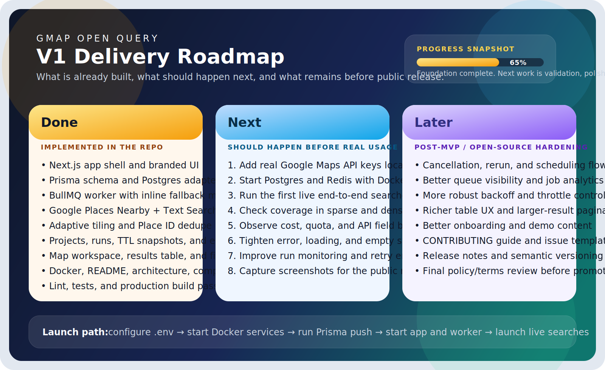

# Prospecting Console

Prospecting Console is a self-hosted Google Places prospecting app built with Next.js, Prisma, BullMQ, PostgreSQL, and Redis. It helps an operator search a defined area, combine preset business types with keyword queries, filter for strong reviews and missing websites, and review the results inside a Google map + list workspace.

## What v1 includes

- Address or city targeting with radius-based search
- Curated business presets plus free-text keyword boosting
- Filters for minimum rating, minimum review count, and missing website
- Saved projects and historical runs
- Google map workspace with export to CSV or JSON
- BullMQ worker support with inline fallback
- TTL-based storage for Google place snapshots

## Stack

- Next.js 16 App Router
- React 19
- Prisma 7 with `@prisma/adapter-pg`
- PostgreSQL
- Redis + BullMQ
- Tailwind CSS 4

## Quick start

1. Copy `.env.example` to `.env`.
2. Fill in `GOOGLE_MAPS_API_KEY` and `NEXT_PUBLIC_GOOGLE_MAPS_API_KEY`.
3. Start the infrastructure:

```bash
docker compose up -d db redis
```

4. Push the schema and generate the client:

```bash
npm install
npm run prisma:generate
npm run db:push
```

5. Start the app and worker:

```bash
npm run dev
npm run worker
```

6. Open `http://localhost:3000`.

## Docker Compose

The repository includes a `docker-compose.yml` with:

- `db`: PostgreSQL 16
- `redis`: Redis 7
- `web`: Next.js app
- `worker`: BullMQ worker

Run the full stack with:

```bash
docker compose up --build
```

## Environment variables

See [.env.example](./.env.example) for the full list. The required ones are:

- `DATABASE_URL`
- `REDIS_URL`
- `GOOGLE_MAPS_API_KEY`
- `NEXT_PUBLIC_GOOGLE_MAPS_API_KEY`

## Development commands

```bash
npm run dev
npm run worker
npm run lint
npm run test
npm run prisma:generate
npm run db:push
npm run build
```

## Compliance notes

- This project is designed as an in-app qualification tool, not a durable Google-powered lead database.
- Place snapshots are stored with a TTL. Projects and Place IDs can remain after snapshots expire.
- Exports are generated on demand and are not retained server-side.
- Re-check Google Maps Platform terms and any EEA-specific terms before public release or production use.

More detail lives in [docs/compliance.md](./docs/compliance.md) and [docs/architecture.md](./docs/architecture.md).
To launch the app locally with real keys and services, see [docs/launch-v1.md](./docs/launch-v1.md).

## Project status

For a visual overview of what is implemented and what is still left, see [docs/status-summary.md](./docs/status-summary.md).


