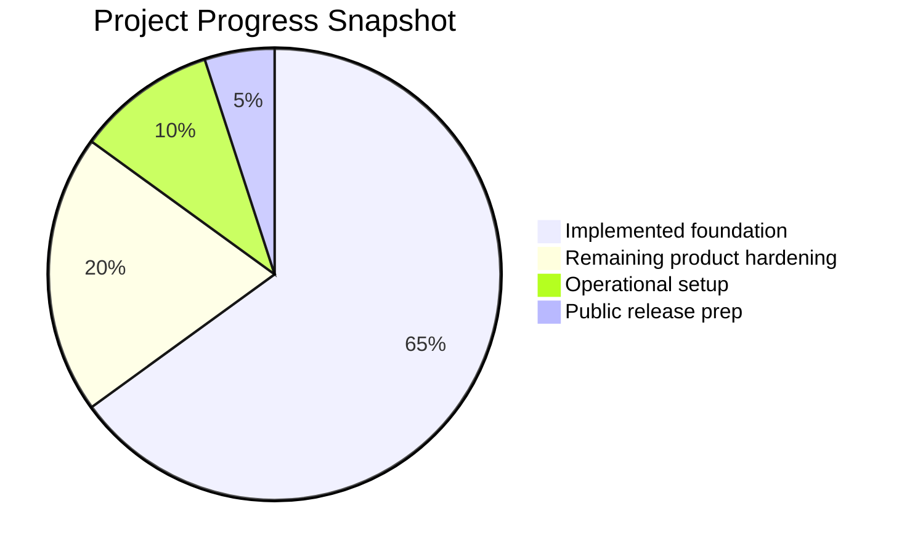
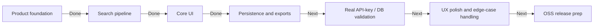
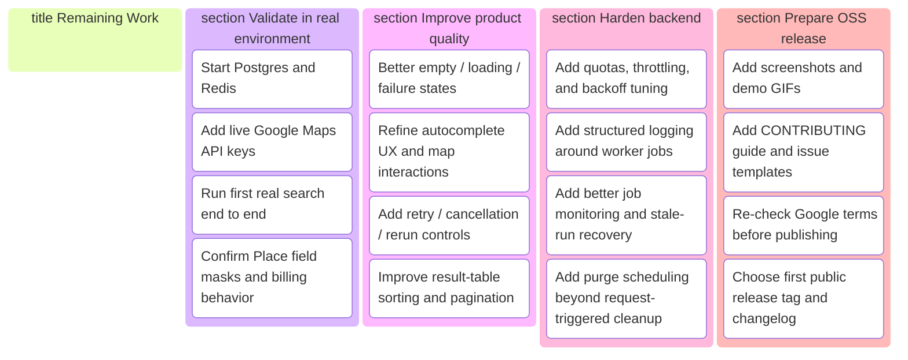

# Status Summary

This page is the fastest way to understand what is already in the repo and what still needs to happen before a polished public release.

## Progress Snapshot

## Delivery Board

## What Is Done

- App foundation is in place with Next.js, Prisma 7, PostgreSQL, Redis, BullMQ, Tailwind, Docker, and repo docs.
- Search creation works conceptually end to end:
  - area selection inputs
  - radius-based searches
  - business presets plus keyword query
  - rating / review count / missing website filters
- Google Places orchestration is implemented:
  - Nearby Search per type
  - Text Search as a supplemental pass
  - adaptive tile splitting in saturated areas
  - deduping by Place ID
- Data persistence is implemented:
  - `Project`
  - `SearchRun`
  - `PlaceReference`
  - TTL-based `RunPlace`
- Review workflow is implemented:
  - home dashboard
  - project detail page
  - run detail workspace
  - Google map + results table
  - CSV / JSON export
- Engineering baseline is in good shape:
  - `lint` passes
  - `test` passes
  - production `build` passes

## What Is Left

## Recommended Next Steps

1. Validate the app against a real `DATABASE_URL`, `REDIS_URL`, and Google Maps API key.
2. Run two or three real searches in low-density and high-density areas to evaluate result coverage and API cost.
3. Tighten UX around queued/running/failed states so the product feels solid before public screenshots.
4. Add repo polish for GitHub: screenshots, contribution docs, and a first release checklist.

## Release Readiness Checklist

- [x] Greenfield app scaffolded
- [x] Core data model implemented
- [x] Search orchestration implemented
- [x] Primary UI routes implemented
- [x] Export flow implemented
- [x] Docker and environment docs added
- [x] Lint, tests, and production build passing
- [ ] Real environment smoke test completed
- [ ] API cost / quota behavior observed with live keys
- [ ] UX polish pass completed
- [ ] Open-source release assets prepared
